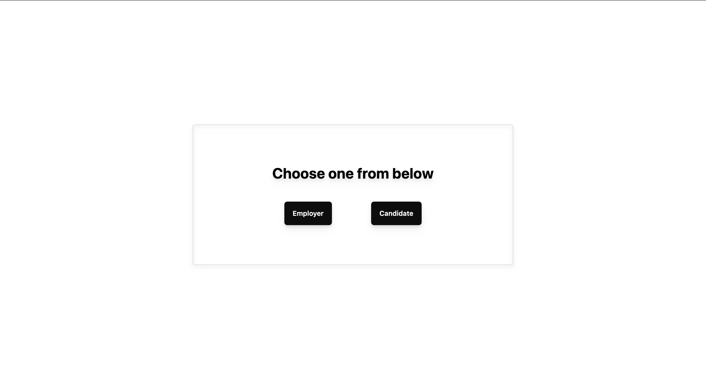
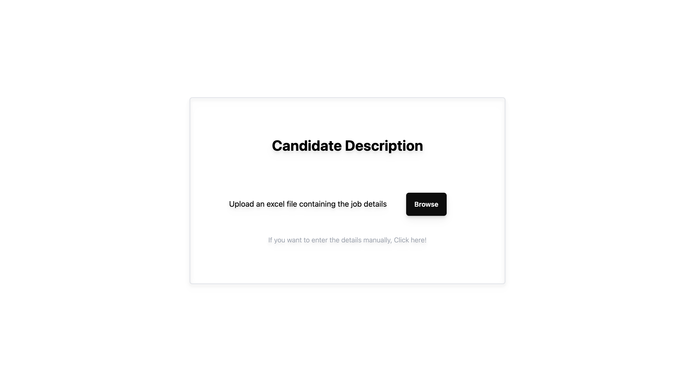

# Quickstart
To run the website locally, clone the repo and run
```
npm install
npm run dev
```

The layout is designed as follows:
## Homepage


## Candidate page



# Todo
- [x]<s> Add support for the home page </s>
- [x]<s> Add support for candidate page </s>
- [ ] Add support for candidate manual entry
- [ ] Add support for employer page
- [ ] Add support for employer manual entry
